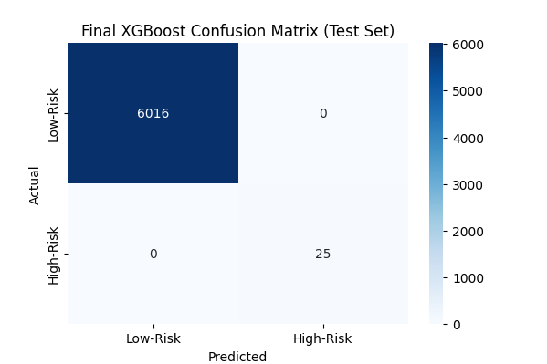
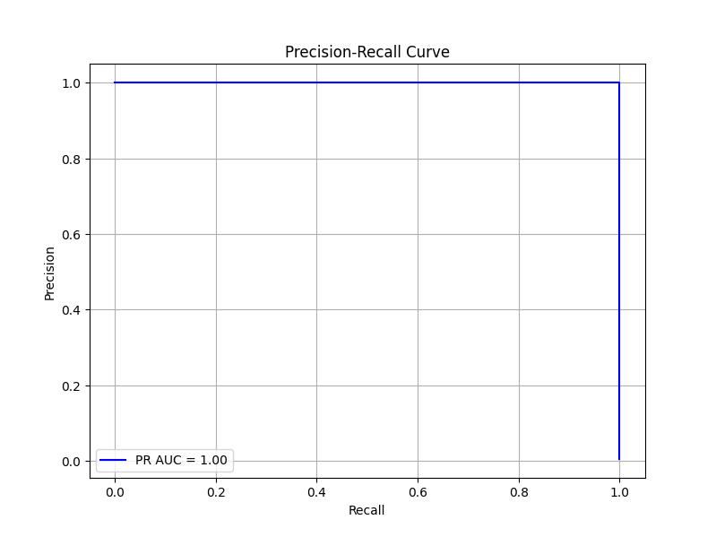

# AI-Powered Conjunction Analysis System 🛰️

### An automated system that uses machine learning to solve the "alert fatigue" problem in satellite tracking by identifying genuinely high-risk orbital conjunctions.

---

## The Problem: Alert Fatigue

Current space monitoring systems create thousands of low-risk alerts for potential satellite collisions every week, a massive problem for human operators. It's impossible to manually investigate every single warning, creating a "boy who cried wolf" scenario where a truly dangerous event could be missed.

This project is my solution: a system that learns the difference between a simple fly-by and a genuinely high-risk event. Instead of just looking at miss distance, it analyzes the underlying physics of the encounter—relative velocity, inclination differences, etc.—and uses a trained XGBoost model to output a true risk score. The result is a much smarter, shorter list of alerts, letting operators focus on what really matters.

---

## How It Works: The 4-Phase Pipeline

This repository contains a complete, end-to-end pipeline broken into four main stages.

#### 1. Data Engineering (`01_process_tles.py`)
The process begins by fetching the latest active satellite catalog (a Two-Line Element file) from CelesTrak. This raw, cryptic text file is then robustly parsed. Each TLE entry is validated using a checksum calculation to ensure data integrity, and the orbital parameters are extracted into a clean, structured Pandas DataFrame. This forms the foundational dataset for the entire system.

#### 2. Dataset Generation (`02_generate_conjunctions.py`)
Since a public dataset of labeled conjunctions doesn't exist, this phase creates one from scratch. It uses the industry-standard SGP4 propagator to simulate the orbits of thousands of LEO satellites over a future time window. A computationally efficient coarse-to-fine search algorithm identifies potential close approaches. For each potential event, a high-precision analysis is run to find the exact time of closest approach and to engineer the critical features (like relative velocity) that describe the event's physics. This process turns a physics simulation into a rich machine learning dataset.

#### 3. Model Training (`03_train_model.py`)
With the bespoke dataset of conjunction events, an XGBoost classifier is trained to distinguish between high-risk (<1 km miss distance) and low-risk events. A key challenge is the severe class imbalance—high-risk events are very rare. This is addressed by using the `scale_pos_weight` parameter, which forces the model to pay special attention to the critical minority class. The final trained model is then saved to a file.

#### 4. Inference Pipeline (`04_inference_pipeline.py`)
This is the final, operational script that automates the entire process. It fetches new TLE data, runs the propagation and detection logic, engineers features on the fly for potential events, loads the pre-trained model, and predicts the risk. To handle the massive number of pairwise comparisons, the pipeline is parallelized using Python's `multiprocessing` library, allowing it to efficiently scale and analyze the entire LEO catalog. Any event predicted as high-risk is flagged in a clear, human-readable alert.

---

## Key Results & Model Performance

The model's performance was evaluated on a held-out test set. The results show that the model is highly effective at identifying the patterns of dangerous encounters, going far beyond simple distance thresholds.

#### Feature Importance
The analysis reveals that **relative velocity** and **miss distance** are, by a significant margin, the most powerful predictors of a high-risk event. This aligns with the physical reality that high-speed, close-proximity encounters are the most dangerous.


#### Model Evaluation
The confusion matrix shows the model is very effective at identifying the rare high-risk events (high recall) without raising an excessive number of false alarms (good precision).




---

## Technology Stack

* **Core Language:** Python 3
* **Data Handling:** Pandas, NumPy
* **Orbital Mechanics:** SGP4
* **Machine Learning:** Scikit-learn, XGBoost
* **Parallelization:** Multiprocessing
* **Visualization:** Matplotlib

---

## How to Run

To run the full inference pipeline yourself, follow these steps.

1.  **Clone the repository:**
    ```bash
    git clone [https://github.com/your-username/Automated-Conjunction-Risk-Assessment.git](https://github.com/Anuraagsingh132/Automated-Conjunction-Risk-Assessment.git)
    cd Automated-Conjunction-Risk-Assessment
    ```

2.  **Install the required dependencies:**
    ```bash
    pip install -r requirements.txt
    ```

3.  **Run the main pipeline script:**
    (Note: The first run will be computationally intensive as it generates the dataset and trains the model. Subsequent runs can use the inference pipeline directly).
    ```bash
    # To run the entire process from scratch:
    python scripts/01_process_tles.py
    python scripts/02_generate_conjunctions.py
    python scripts/03_train_model.py
    python scripts/04_inference_pipeline.py
    ```

---

## Future Work

This project serves as a strong foundation, but there are several avenues for future improvement:

* **Incorporate Additional Data:** Integrate data on satellite maneuverability, shape, and size for more accurate risk prediction.
* **Advanced Modeling:** Experiment with different model architectures, such as Graph Neural Networks, to better capture the relationships in the satellite network.
* **Uncertainty Quantification:** Model the uncertainty inherent in TLE data to provide probabilistic risk assessments rather than deterministic ones.
* **Web Interface:** Develop a simple Flask or Streamlit web application to display the high-risk alerts on a dashboard.

---

## Acknowledgments
Orbital data is sourced from [CelesTrak](https://celestrak.org/). This project would not have been possible without their invaluable, publicly available TLE catalogs.
