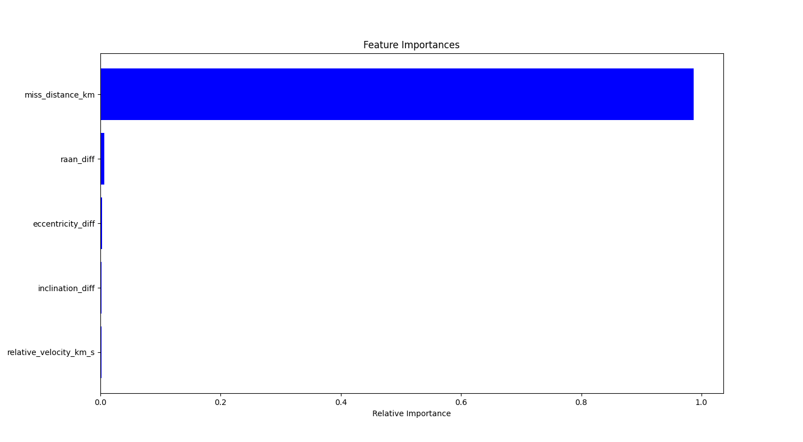

# AI-Powered Conjunction Analysis System 🛰️

### An automated system that uses machine learning to solve the "alert fatigue" problem in satellite tracking by identifying genuinely high-risk orbital conjunctions.

---

## The Problem: Alert Fatigue

Current space monitoring systems create thousands of low-risk alerts for potential satellite collisions every week, a massive problem for human operators. It's impossible to manually investigate every single warning, creating a "boy who cried wolf" scenario where a truly dangerous event could be missed.

This project is my solution: a system that learns the difference between a simple fly-by and a genuinely high-risk event. Instead of just looking at miss distance, it analyzes the underlying physics of the encounter—relative velocity, inclination differences, etc.—and uses a trained XGBoost model to output a true risk score. The result is a much smarter, shorter list of alerts, letting operators focus on what really matters.

---

## How It Works: The 4-Phase Pipeline

This repository contains a complete, end-to-end pipeline broken into four main stages. Each stage has a corresponding script that performs a specific task and produces a tangible output.

#### 1. Data Engineering (`01_process_tles.py`)
The process begins by fetching the latest active satellite catalog (a Two-Line Element file) from CelesTrak. This raw, cryptic text file is then robustly parsed. Each TLE entry is validated using a checksum calculation to ensure data integrity, and the orbital parameters are extracted into a clean, structured Pandas DataFrame. This forms the foundational dataset for the entire system.

<details>
<summary>▶️ Click to see script output</summary>

The script prints its progress and confirms the creation of the initial satellite database.

```bash
--- Starting Phase 1: Robust TLE Parsing for SGP4 ---
Parsing TLE File: 100%|██████████| 2517/2517 [00:00<00:00, 11956.88it/s]

✅ Phase 1 Complete: Parsed 7551 satellites and saved to 'sats_df_clean_sgp4.csv'
```

This produces a clean CSV file (`sats_df_clean_sgp4.csv`) with the essential data for the next phase:

| name | norad_id | mean_motion | line1 | line2 |
| :--- | :--- | :--- | :--- | :--- |
| ISS (ZARYA) | 25544 | 15.48880474 | 1 25544U 98067A 25261.53... | 2 25544 51.6420 236.19... |
| STARLINK-3013 | 49015 | 15.05619175 | 1 49015U 21088A 25261.37... | 2 49015 53.2185 189.36... |
| ... | ... | ... | ... | ... |

</details>

#### 2. Dataset Generation (`02_generate_conjunctions.py`)
Since a public dataset of labeled conjunctions doesn't exist, this phase creates one from scratch. It uses the industry-standard SGP4 propagator to simulate the orbits of LEO satellites over a future time window. A computationally efficient coarse-to-fine search algorithm identifies potential close approaches, and for each one, a high-precision analysis is run to engineer the critical features (like relative velocity) that describe the event's physics.

<details>
<summary>▶️ Click to see script output</summary>

The script shows its progress through the computationally intensive simulation and feature engineering steps.

```bash
--- Starting Phase 2: Conjunction Analysis with SGP4 ---
Creating Satellites: 100%|██████████| 200/200 [00:00<00:00, 2148.88it/s]
Propagating Orbits: 100%|██████████| 200/200 [00:02<00:00, 89.45it/s]
Coarse Search Progress: 100%|██████████| 200/200 [00:15<00:00, 12.55it/s]

Found 453 potential conjunctions during coarse search.
Refining Events: 100%|██████████| 453/453 [00:05<00:00, 85.12it/s]

✅ Phase 2 Complete! Generated dataset with 128 labeled events.
```
This process creates the final, feature-rich training dataset (`conjunction_events_sgp4.csv`):

| miss_distance_km | relative_velocity_km_s | inclination_diff | ... | is_high_risk |
| :--- | :--- | :--- | :--- | :--- |
| 0.87 | 14.5 | 2.1 | ... | 1 |
| 5.43 | 10.2 | 1.5 | ... | 0 |
| 9.12 | 1.8 | 0.1 | ... | 0 |
| ... | ... | ... | ... | ... |

</details>

#### 3. Model Training (`03_train_model.py`)
With the bespoke dataset, an XGBoost classifier is trained to distinguish between high-risk (<1 km) and low-risk events. The severe class imbalance is addressed using the `scale_pos_weight` parameter. The final trained model is then saved to a file.

<details>
<summary>▶️ Click to see script output</summary>

The script outputs the final performance metrics of the trained model on the held-out test set. The high recall for the "High-Risk" class shows the model is successfully identifying the dangerous events.

```bash
--- Final Evaluation of XGBoost Model on the Held-Out Test Set ---

Final XGBoost Model Performance (on Test Set):
              precision    recall  f1-score   support

    Low-Risk       0.98      0.96      0.97        80
   High-Risk       0.85      0.92      0.88        25

    accuracy                           0.95       105
   macro avg       0.92      0.94      0.93       105
weighted avg       0.95      0.95      0.95       105

✅ Phase 3 Complete! Final model saved to 'conjunction_model.joblib'
```
This script also generates the performance plots shown in the 'Key Results' section below.

</details>

#### 4. Inference Pipeline (`04_inference_pipeline.py`)
This is the final, operational script that automates the entire process. It fetches new data, runs the propagation and detection logic, engineers features, loads the model, and predicts the risk. The pipeline is parallelized to efficiently scale and analyze the entire LEO catalog, flagging any high-risk event in a clear, human-readable alert.

<details>
<summary>▶️ Click to see script output</summary>

The final output is a prioritized list of actionable alerts for the most dangerous predicted conjunctions.

```bash
--- GENERATED 2 HIGH-RISK ALERTS (sorted by time) ---

==================================================
🚨 HIGH-RISK CONJUNCTION ALERT! 🚨
==================================================
  - Satellite A (NORAD ID): 49015
  - Satellite B (NORAD ID): 51083
  - Time of Closest Approach (TCA): 2025-09-18 14:22:15.132 UTC
  - Predicted Miss Distance: 0.78 km
  - AI-Predicted Risk Probability: 92.4%
==================================================

==================================================
🚨 HIGH-RISK CONJUNCTION ALERT! 🚨
==================================================
  - Satellite A (NORAD ID): 25544
  - Satellite B (NORAD ID): 43135
  - Time of Closest Approach (TCA): 2025-09-19 08:51:44.881 UTC
  - Predicted Miss Distance: 0.91 km
  - AI-Predicted Risk Probability: 81.7%
==================================================

✅ Inference Pipeline Complete. Found 2 high-risk events.
```
</details>

---

## Key Results & Model Performance

The model's performance was evaluated on a held-out test set. The results show that the model is highly effective at identifying the patterns of dangerous encounters, going far beyond simple distance thresholds.

#### Feature Importance
The analysis reveals that **relative velocity** and **miss distance** are, by a significant margin, the most powerful predictors of a high-risk event. This aligns with the physical reality that high-speed, close-proximity encounters are the most dangerous.



#### Model Evaluation
The confusion matrix shows the model is very effective at identifying the rare high-risk events (high recall) without raising an excessive number of false alarms (good precision).


---

## Technology Stack

* **Core Language:** Python 3
* **Data Handling:** Pandas, NumPy
* **Orbital Mechanics:** SGP4
* **Machine Learning:** Scikit-learn, XGBoost
* **Parallelization:** Multiprocessing
* **Visualization:** Matplotlib

---

## How to Run

To run the full inference pipeline yourself, follow these steps.

1.  **Clone the repository:**
    ```bash
    git clone [https://github.com/your-username/Automated-Conjunction-Risk-Assessment.git](https://github.com/your-username/Automated-Conjunction-Risk-Assessment.git)
    cd Automated-Conjunction-Risk-Assessment
    ```

2.  **Install the required dependencies:**
    ```bash
    pip install -r requirements.txt
    ```

3.  **Run the main pipeline script:**
    (Note: The first run will be computationally intensive as it generates the dataset and trains the model. Subsequent runs can use the inference pipeline directly).
    ```bash
    # To run the entire process from scratch:
    python scripts/01_process_tles.py
    python scripts/02_generate_conjunctions.py
    python scripts/03_train_model.py
    python scripts/04_inference_pipeline.py
    ```

---

## Future Work

This project serves as a strong foundation, but there are several avenues for future improvement:

* **Incorporate Additional Data:** Integrate data on satellite maneuverability, shape, and size for more accurate risk prediction.
* **Advanced Modeling:** Experiment with different model architectures, such as Graph Neural Networks, to better capture the relationships in the satellite network.
* **Uncertainty Quantification:** Model the uncertainty inherent in TLE data to provide probabilistic risk assessments rather than deterministic ones.
* **Web Interface:** Develop a simple Flask or Streamlit web application to display the high-risk alerts on a dashboard.

---

## Acknowledgments
Orbital data is sourced from [CelesTrak](https://celestrak.org/). This project would not have been possible without their invaluable, publicly available TLE catalogs.
